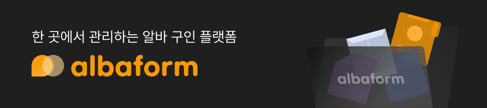
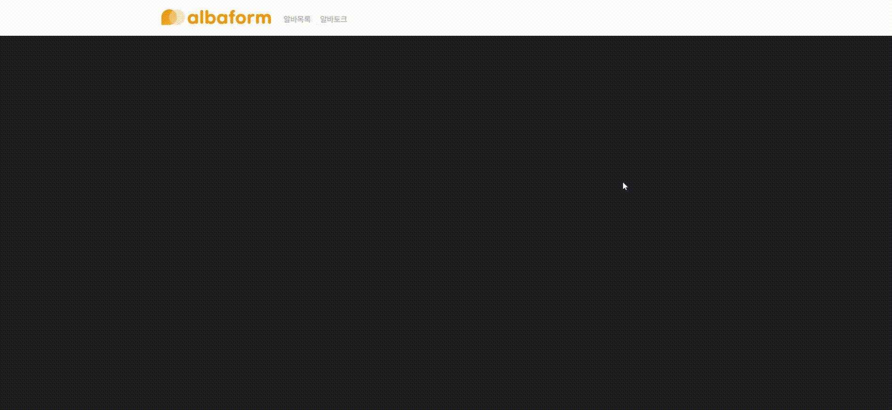
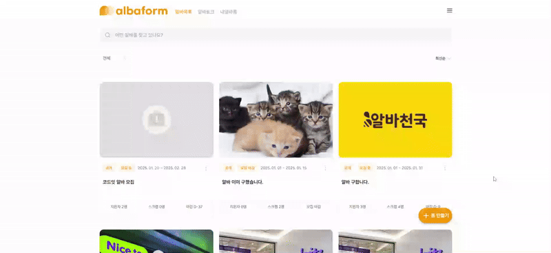
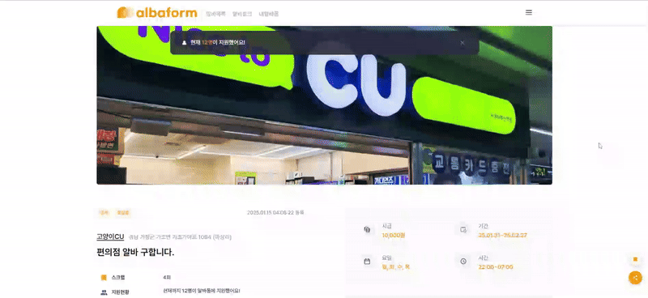

# 👷 Albaform



> Codeit Sprint FE10 Advanced Project ( 2024.12.15 ~ 2025.01.25 )<br />
> Part-time Job Platform **Albaform**

<br />

## 📌 References

- 🔗 Deployment Link : [**Albaform**](https://www.albaform.store/)
- 🎇 Dev Docs Link : [**Albaform-Notion**](https://jsh-note.notion.site/Albaform-15577eb7f18580a5b54ae0d0836e7f0b)

<br />

## ⚡ Project Overview

- **Landing Page**



- **Albaform Page**


- **Albaform Add/Apply Page**

|                                   Add                                   |                                    Apply                                    |
| :---------------------------------------------------------------------: | :-------------------------------------------------------------------------: |
|  |  |

- **My Albaform Page**

|                                     Owner                                      |                                     Applicant                                      |
| :----------------------------------------------------------------------------: | :--------------------------------------------------------------------------------: |
|  |  |

- **Albatalk Page**


- **My Page**


<br />

## 👩‍💻 Team Members

<div align="center">

|                                  김수영                                  |                                  김희진                                  |                                  나지원                                   |                                  정성현                                  |
| :----------------------------------------------------------------------: | :----------------------------------------------------------------------: | :-----------------------------------------------------------------------: | :----------------------------------------------------------------------: |
|  |  |  |  |
|                 [@swim-kim](https://github.com/swim-kim)                 |                 [@devmanta](https://github.com/devmanta)                 |                  [@najitwo](https://github.com/najitwo)                   |                  [@jsh1147](https://github.com/jsh1147)                  |

</div>

<br />

## 🛠 Tech Stack

- **Environment**

  -   

- **Build & Deployment**

  -    

- **FE Tech**

  -     
  -    
  -  

- **Quality Control**

  -    

- **Collaboration Tool**

  -   

<br />

## 🗂️ Project Structure

```
Albaform
├─ .github                : GitHub configurations
├─ app                    : App-wide files
│   ├─ api                : Internal APIs
│   └─ (page folders)     : Page components
│        └─ _components   : Page's components
├─ components             : Reusable components
├─ constants              : Constants
├─ hooks                  : Custom React hooks
├─ public                 : Static files
│   ├─ fonts              : Fonts
│   ├─ icons              : Icons
│   └─ images             : Images
├─ services               : External APIs
├─ store                  : State management
├─ types                  : Type definitions
└─ utils                  : Utility functions
```

<br />

## 💻 Usage

> Needs to add environment variables

```
git clone https://github.com/codeit-sprint-fe10/Albaform.git
cd Albaform
npm install
npm run dev
```

<br />
